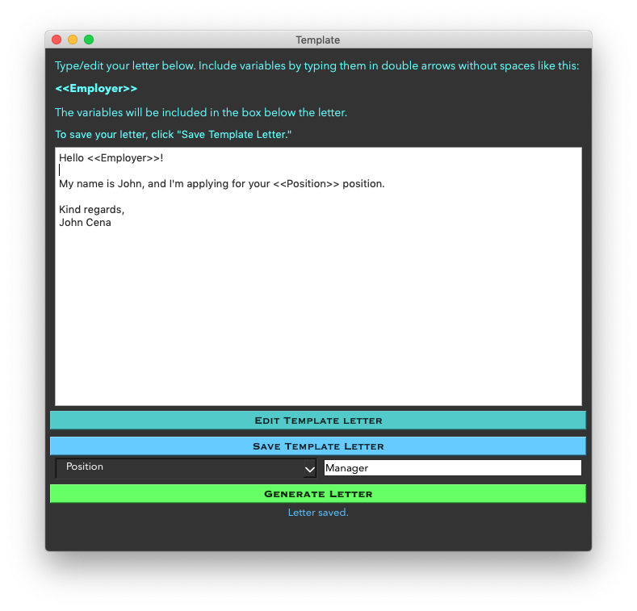
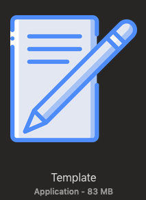

# Template
A python application I developed which allows you to generate a template letter and change just the few words you want to change. Was intended for cover letters but can be used for anything.

